<div align="center">
  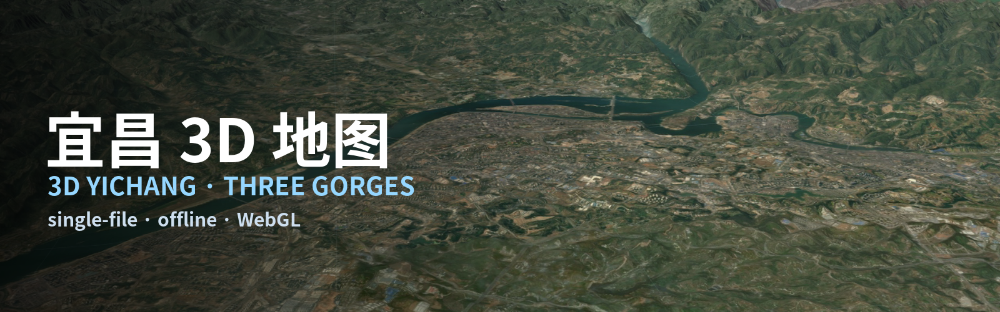
</div>

<div align="center">
  <a href="./README.md">English</a> &nbsp;·&nbsp; <b>中文</b>
</div>
<br>

<div align="center" style="line-height: 1.9;">
  <!-- 试玩入口 -->
  <a href="https://b23.tv/aunUQsI"></a>
  <a href="https://radiosky-bilibili.github.io/yichang-3d/"></a>
  <br>
  <!-- 技术栈 -->
  <a href="https://threejs.org/"></a>
  
  
  
  <br>
  <!-- 许可与规模 -->
  <a href="./LICENSE"></a>
  
  
</div>

<br>

> ### ⚠️ 再分发这个文件之前，请先读这段
>
> **本项目内嵌的卫星影像属于 Esri 及其合作伙伴 —— 它不是开放数据，本项目也无权把任何相关权利转授给你。**
>
> 影像以 base64 形式直接写在 `index.html` 里，所以**下载这个文件，就等于拿到了一份 Esri 影像的副本**。用于个人、离线、非商业地查看，正是本项目被做出来的场景。**但如果你要再发布、转载、镜像、打包、售卖或在其上二次开发，请先自行向 Esri 获取授权 —— 或者把影像替换为开放数据。** 详见[版权、署名与许可](#-版权署名与许可)一节，那里也给出了两条出路。
>
> **代码**是 MIT 的，你可以自由使用；受到限制的是**影像**。

**一个可在浏览器里完全离线运行的单文件 3D 地图 —— 覆盖长江三峡宜昌段。**

渲染器、着色器、界面、卫星影像和高程模型全部装在这一个 **32.5 MB 的 `.html` 文件**里。不需要服务器，不需要构建，不需要包管理器；下载后也**完全不需要联网**。打开文件就能起飞。

**立刻试玩 —— 无需下载：**

- **国内用户推荐：** [**宜昌 3D 地图 · 纸飞机飞行 · 真实体积云**](https://b23.tv/aunUQsI) —— 作为**哔哩哔哩 Toy** 运行（Beta 版），**在 B 站 App 内打开**，手机上体验最好。
- **其他地区：** <https://radiosky-bilibili.github.io/yichang-3d/> —— 同一张地图，托管在 GitHub Pages。

**下载离线版：** [v1.2 —— index.html，32.5 MB](https://github.com/Radiosky-bilibili/yichang-3d/releases/download/v1.2/yichang-3d-v1.2.html) —— 当前稳定版，保存后完全离线可用
&nbsp;·&nbsp; [**lab · 航线飞行**](https://github.com/Radiosky-bilibili/yichang-3d/releases/tag/lab-river-flight)，31.6 MB —— 🧪 实验：长江全程自动飞行相机

*哔哩哔哩 Toy 版和 GitHub Pages 版是同一张地图，只是打包方式不同。交互式 3D 需要 WebGL 2，较老的设备可能吃力。*

地图覆盖 **63.1 × 46.3 公里**的真实地形，西起三峡大坝，东至宜昌三峡机场，长江从中穿过。

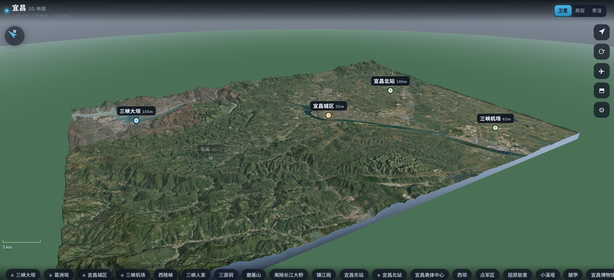

---

## 目录

1. [功能](#-功能)
2. [界面展示](#-界面展示)
3. [快速开始](#-快速开始)
4. [操作方式](#-操作方式)
5. [覆盖范围与数据来源](#-覆盖范围与数据来源)
6. [技术内幕](#-技术内幕)
7. [关于本项目](#-关于本项目)
8. [版权、署名与许可](#-版权署名与许可)
9. [已知限制](#-已知限制)
10. [仓库结构](#-仓库结构)
11. [致谢](#-致谢)
12. [制作花絮仓库](#-制作花絮--单独的仓库)

---

## 功能

### 1. 看地图，认识地标

- **三种视图模式** —— *卫星*（真实 Esri 影像）、*高程*（分层设色）、*晕渲*（山体阴影灰度图）。
- **20 个地标**，带名称和高程，另有 2 个河流标注。点击标记会弹出简介卡片；当地形遮挡时会自动隐藏，标签之间也会互相推开，永不重叠。
- **底部快捷跳转栏** —— 点击*三峡大坝*、*葛洲坝*、*宜昌市区*或*宜昌三峡机场*，镜头会飞过去。
- **自动巡游 / 自动旋转 / 俯视**按钮：可以让镜头自己在地图上漫游，也可以每隔几秒在各地标之间轮转。
- **罗盘、实时比例尺、帧率读数**，以及经纬网格和可选等高线。

### 2. 驾驶虚拟纸飞机

- 一架折纸飞机，用几何体建模（上方是宽大的平直机翼，下方是窄 V 形尾翼）。
- 在屏幕上任意位置拖动即可操控 —— 左右控制压坡转向，上下控制俯仰。右侧有两个油门按钮。
- 飞行 HUD：**速度（km/h）、高度（m）、航向（°）、离地高度**，以及油门条。
- 飞起来之后世界会活过来：飞机下方有柔和阴影，可翻越也可穿越的体积云团，随高度升高而淡出的低空雾霾层，以及山谷浓、山脊淡的山间雾气。

### 3. 大量可调参数

设置面板把整个地图的外观都开放出来：

| 设置项 | 范围 | 默认值 |
| --- | --- | --- |
| 地形夸张系数 | 0 – 3× | 1.5× |
| 太阳方位角 | 0 – 360° | 135° |
| 太阳高度角 | 5 – 85° | 42° |
| 雾 / 霾浓度 | 0 – 100 | 18 |
| 标签大小 | 70 – 150 % | 100 % |
| 地形网格精度 | 每边 512 / **768** / 1024 个顶点 | 768 |

六个独立开关：**地标标签、经纬网格、等高线、晕渲、山间雾气、地面阴影。** 拖动太阳滑块会实时重新照亮整个地形、天空和雾色 —— 无需重建，无需刷新。

### 4. 长江航线 —— FPV 自动飞行 *（FPV 版版新增）*

一条电影感的飞行镜头，顺长江飞 **82.4 公里**：从三峡大坝上游的库区一直飞到宜昌三峡机场。

- **点右侧按钮栏最上面的「航线」按钮**（或按 `F` 键），地图把镜头交给航线飞行，同时把自己的界面收起来。
- 相机贴着河谷飞：**离江面约 150 米**掠过，进弯自动压坡，速度越快视场角越开（巡航约 670 km/h，开阔段约 820 km/h），并带一点手持式晃动。
- **它会自己介绍沿途地标**：接近地标时爬升几百米并转向正对它 —— 三峡大坝、西陵峡、三峡人家、三游洞、葛洲坝、宜昌城区、宜昌东站、三峡机场 —— 信息卡淡入（名称 / 类别 / 海拔 / 距航线距离），十字准星锁定目标，地标飞出画面时变成边缘指向箭头；离航线较远的景点会提前发现并用长焦拍摄。
- **追机 HUD**：速度、海拔、离地高度、航向、全程进度条（含地标刻度）与下一地标距离。
- **底部控制条**：速度（0.7× / 1× / 1.4×）、地标追踪开关、HUD 开关、**上一个 / 下一个航点（◀ ▶，或键盘 `←` `→`）** —— 不用干等长距离巡航 —— 以及退出。
- **挂机自动巡航**：地图闲置两分钟后，自动开启自带的巡航模式（20 个地标每 4.2 秒切换一个），走完一圈后自动交还地图；任何触摸立即接管。可在**显示设置 → 挂机自动巡航**里关掉或改时长。
- 它是**实时渲染，不是视频**：文件里没有任何视频数据，只是用脚本驾驶这张地图自己的渲染器 —— 整个功能只给 31 MB 的页面加了约 40 KB 的 JavaScript。

---

## 界面展示

电脑端与手机端对照，四个场景各一组。

| 电脑端 | 手机端 |
| :---: | :---: |
| <br>*地图全景* | 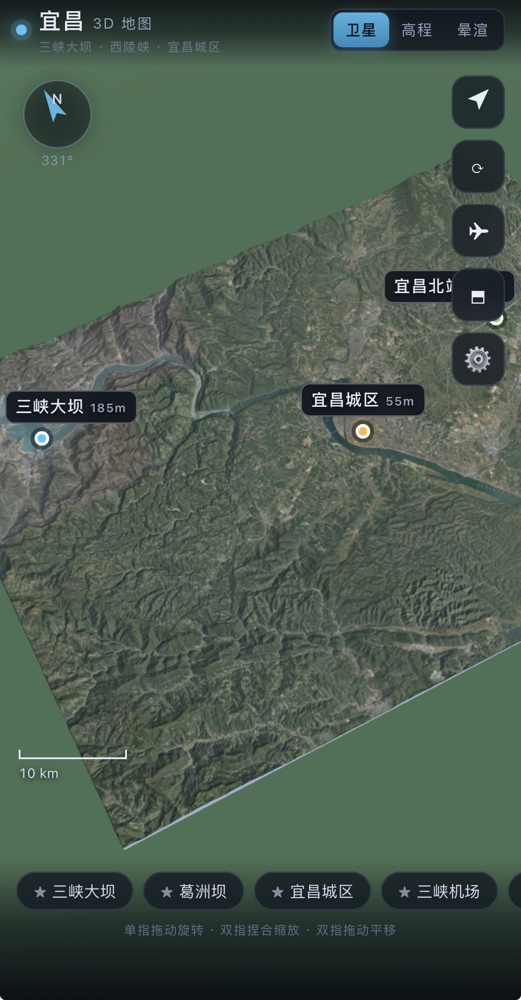<br>*地图全景* |
| 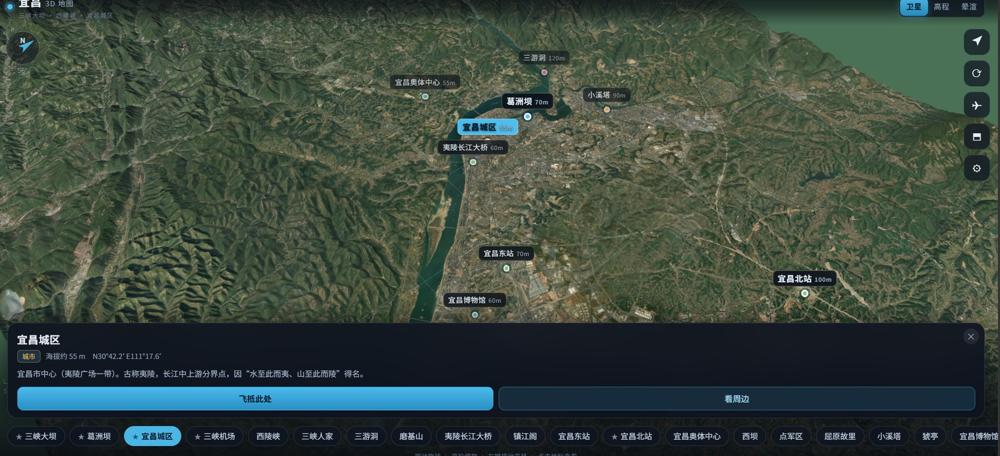<br>*地标卡片* | 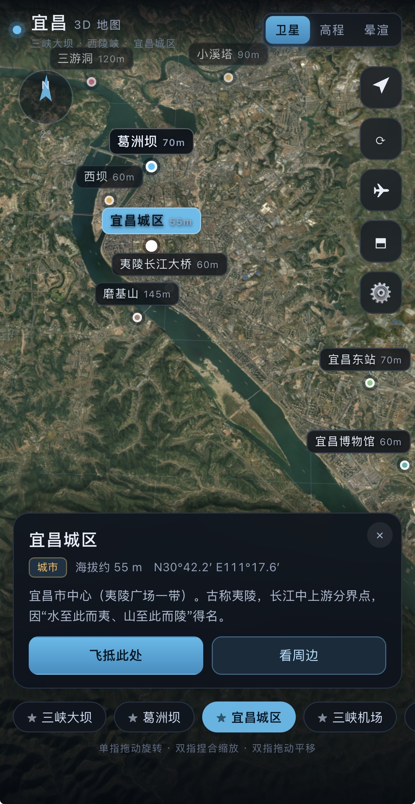<br>*地标卡片* |
| 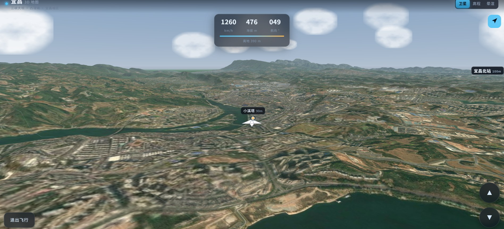<br>*驾驶纸飞机* | 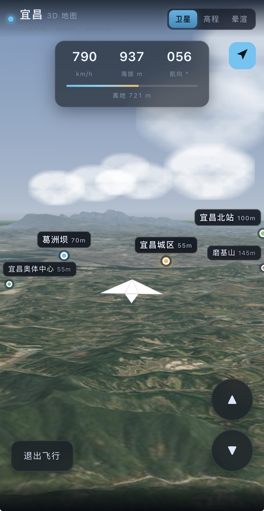<br>*驾驶纸飞机* |
| 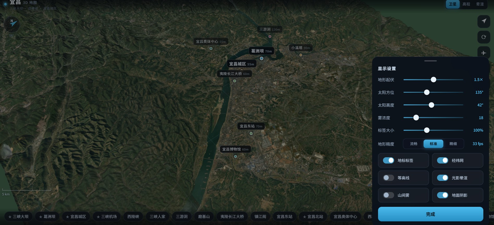<br>*设置面板* | 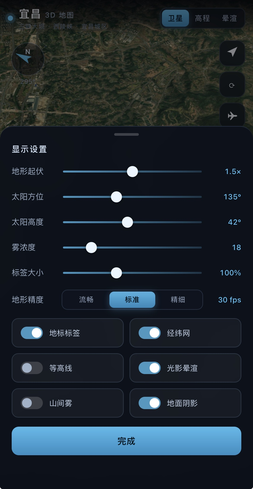<br>*设置面板* |
| 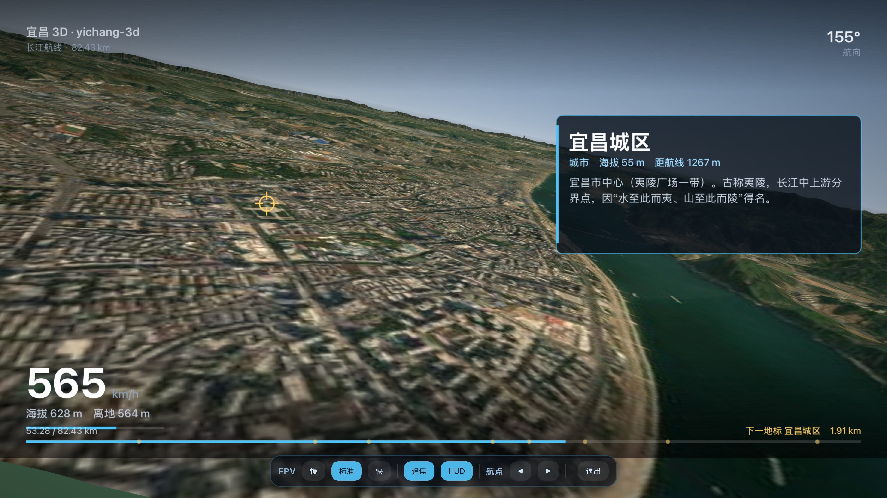<br>*FPV 航线飞行（预览版）* | 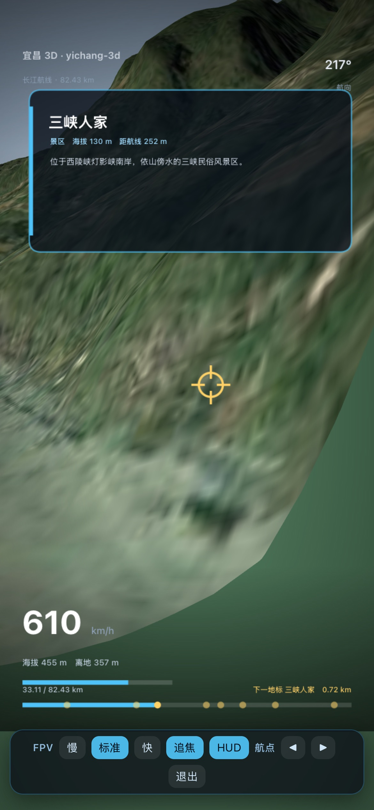<br>*FPV 航线飞行（预览版）* |

---

## 快速开始

**方式一 —— 现在就看，无需安装任何东西**

<https://radiosky-bilibili.github.io/yichang-3d/>

由 GitHub Pages 直接从 `main` 分支托管。首次访问请多等几秒：页面自带 31 MB 的影像和高程数据。

**方式二 —— 下载下来，离线使用**

1. 下载 `index.html`（32.5 MB —— 单个文件，就是整个程序）：[**v1.2 正式版**](https://github.com/Radiosky-bilibili/yichang-3d/releases/tag/v1.2)。想试实验性的[航线飞行相机](https://github.com/Radiosky-bilibili/yichang-3d/releases/tag/lab-river-flight)也可以，但那是实验版本、不保证可用。全部版本见[所有发布](../../releases)。
2. 打开它：
   - **iPhone / iPad** —— 存到*文件*里，点一下即可。
   - **电脑** —— 直接双击。
3. 就这样。开飞行模式也没问题 —— 这个文件从不联网。

**运行要求：** 任何支持 WebGL 2 的浏览器（Safari 15+、Chrome、Edge、Firefox）。在手机上运行也很流畅；「精细」地形模式最好看，也最吃性能。

---

## 操作方式

| 操作 | 手势 / 按钮 |
| --- | --- |
| 环绕地图 | 单指拖动（或鼠标左键拖动） |
| 缩放 | 双指捏合（或鼠标滚轮） |
| 平移 | 双指拖动（或鼠标右键拖动） |
| 驾驶飞机 | 飞行模式下拖动 —— 水平方向控制转向，垂直方向控制俯仰 |
| 油门 | ▲ / ▼ 按钮（按住可连续变化） |
| 退出飞行模式 | *退出飞行*按钮；镜头会回到飞机所在位置 |
| 进入 / 退出 FPV 航线飞行 *（FPV 独立版）* | 右侧按钮栏最上方的「航线」按钮，或 `F` / `Esc` |
| 飞行中跳到上 / 下一个地标 *（FPV 独立版）* | 控制条上的 ◀ / ▶，或键盘 `←` `→` |

---

## 覆盖范围与数据来源

| | |
| --- | --- |
| 范围 | 东经 110.918° – 111.577°，北纬 30.487° – 30.902°（63.1 × 46.3 公里） |
| 高程范围 | −153 米 … 1492 米 |
| 高程模型 | AWS Open Data *Terrain Tiles*（Terrarium PNG，z12，约 33 米/采样点），1024 × 1024 网格 |
| 影像 | Esri World Imagery：全域 z14（8.2 米/像素）+ **六块高清补丁**（城区核心 2.05、三峡大坝 1.72、秭归／机场／两个火车站 2.05 米/像素）。**非开放数据 —— 见顶部提示。** | 基准 | GCJ-02 对齐（见*版权*一节中的说明） |
| 地标 | 20 个兴趣点 + 2 个河流标注 |

---

## 技术内幕

- **three.js r146**，内联进文件（MIT 许可），WebGL 2。
- **高度在 GPU 上施加。** 地形网格只存储 X/Z 和一个打包的坡度值；顶点着色器采样 Terrarium 编码的高程纹理并对每个顶点做位移。改变夸张系数只是一次 uniform 写入，所以是瞬时的。
- **分层设色**生成为一张 256 × 1 纹理，在高程视图下于片元着色器中混合。
- **着色器中的细节层次：** 等高线宽度和城区细节层的强度，会根据相机当前所见的「米/像素」自适应。
- **标签系统用 HTML 实现**，而非 GL：屏幕空间定位、沿高程场射线步进做遮挡剔除、贪心防重叠（大地标优先）、限制在视口内，并避开顶栏和底部快捷跳转栏。
- **特意保留了一个小型调试 API：** `window.frame()` 强制单次渲染（当标签页在后台、`requestAnimationFrame` 被节流时很有用），`window.noAnim()` 关闭 CSS 过渡以便截取干净的截图。

- **FPV 飞行是脚本驱动的相机，不是视频。** 航线是在影像上手工描出的长江中心线、再吸附到 DEM 谷底得到的（82.4 公里 / 688 个点），按弧长重新参数化。每帧脚本取曲线上的一个点、采样周边地形算出安全离地高度、把注视点从"沿江前方"平滑混向"下一个地标"，然后把相机交给地图原本的 `requestAnimationFrame` 循环 —— 渲染器、地形和影像全部是地图自己的。
- **HUD 是 DOM canvas 图层**，不在 WebGL 场景里：把 1920 × 1080 的界面画进纹理每帧要 ~57 ms，DOM 图层只要 ~1.4 ms，而且由浏览器免费合成。它会自动适配竖屏 / 横屏版式，底部内容的位置由控制条的实际高度决定。

---

## 关于本项目

这是一个 **AI 生成的项目**，由 **DeepSeekHardness** 与两个 AI 协作者 **MINIS** 和 **Doubao** 共同完成。WebGL 渲染器、着色器、界面、地标数据和本 README 全部由 AI 产出。

所以请对预期保持现实：

- 它是一个**演示品和玩具**，不是产品。会有粗糙的边角、未完成的细节和偶发的画面瑕疵。
- 其中一部分是由自动化导出步骤拼装的，这类步骤可能引入缺陷。本版本中已修复其中两个：一个类型声明错误的着色器 uniform，以及一个重复声明顶点属性的材质。
- 它只在一部手机、一个浏览器上测试过。你的情况可能不同。
- 屏幕上的数字（高程、距离）来自粗略的公开数据，只为氛围服务，不能用于测量。

---

## 版权、署名与许可

### 本项目

本仓库中的应用代码（HTML、JavaScript、GLSL、UI 设计、地标文字和本 README）是在 *DeepSeekHardness* 与 *MINIS*、*Doubao* 的主导下**由 AI 生成**的。

**许可：[MIT](LICENSE)。** 你可以自由使用、复制、修改、合并、发布、再许可和出售本项目自身的代码，唯一条件是：当你再分发其实质性部分时，保留版权声明与许可声明。

关于作者身份，需要说明白：在某些司法辖区（包括美国），纯粹由 AI 生成的产出**可能不受版权保护**，因为版权要求人类作者身份；另一些辖区则把有人类创意主导的 AI 辅助作品视为可保护。本项目不去解决这个法律问题 —— 代码的编排、测试、修正与数据整合是由下列署名者完成的，他们认为整个作品归其所有并可对外授权，因此以 MIT 条款授权给你。若某辖区对其中某部分不承认版权，那部分就是可自由使用的。

MIT 许可**仅适用于本项目自身的代码**。下列第三方组件和数据仍受其各自条款约束，这些条款对你依然有效。

### 第三方代码

| 组件 | 条款 | 对你的影响 |
| --- | --- | --- |
| three.js（内联，r146） | MIT 许可，© 2010–2023 three.js 作者 | 内联包中已带有 SPDX `MIT` 标头 —— 请保留。如果你移除了标头，请把 MIT 声明和版权行加回去。 |
| 其他全部内容 | 为本项目编写 | 适用上述宽松声明 |

### 第三方数据 —— 影像与高程

- **卫星影像：Esri World Imagery。** 瓦片版权归 © Esri、Maxar、Earthstar Geographics 及 GIS User Community 所有，由 Esri 的 ArcGIS World Imagery 服务提供。**本项目不拥有这些影像，也未授予你任何相关权利。**

  **在再分发前请务必读这一段。** 影像以 base64 形式内嵌在 `index.html` 里 —— 也就是说 *本仓库确实在再分发 Esri 的影像*。对这样的静态非商业演示来说这没问题，但这**不是本项目能转授给你的权利**。具体来说：

  | 你想做的事 | 意味着 |
  | --- | --- |
  | 看效果、本地运行、学习代码 | 没问题。 |
  | Fork 仓库并保留影像 | 你就在自己再分发 Esri 影像了。请自取授权，或者换掉影像（见下）。 |
  | 商业使用、或用于产品 | 向 Esri 获取授权。 |
  | 把本仓库当作影像来源 | 请不要。 |

  **如果需要，有两条干净的路：**

  1. **换成开放影像。** 推荐 **Sentinel-2**（ESA / Copernicus，CC BY-SA 3.0 IGO）—— 免费使用、修改和再分发，只需署名。分辨率 10 米/像素，本版用的是 8.2 米/像素，代价约 20% 的细节，并不多。下载、拼接与**配准**影像的构建脚本在 [yichang3d-toolkit](https://github.com/Radiosky-bilibili/yichang3d-toolkit)；该仓库里附带的底图就是用同一套流程做的。

  2. **改为运行时加载影像**，指向你自己能接受的瓦片服务。这是**代码改动**而非数据改动：地形着色器只需要一张纹理，并不关心它从哪来。代价是失去"离线单文件"这个特性。

  高程数据完全没有这些问题 —— 见下。
- **高程：AWS Open Data「Terrain Tiles」—— Terrarium PNG 格式，由 Mapzen（Linux 基金会项目）制作，托管于 `s3://elevation-tiles-prod`。** 瓦片由多套国家级与全球 DEM 拼合而成，**其中若干数据集要求署名**。如果你再发布本项目或其构建产物，请一并保留以下声明：

  ```
  * Mapzen
  * ArcticDEM terrain data DEM(s) were created from DigitalGlobe, Inc., imagery and
    funded under National Science Foundation awards 1043681, 1559691, and 1542736;
  * Australia terrain data (c) Commonwealth of Australia (Geoscience Australia) 2017;
  * Austria terrain data (c) offene Daten Oesterreichs - Digitales Gelaendemodell (DGM) Oesterreich;
  * Canada terrain data contains information licensed under the Open Government
    Licence - Canada;
  * Europe terrain data produced using Copernicus data and information funded by the
    European Union - EU-DEM layers;
  * Global ETOPO1 terrain data U.S. National Oceanic and Atmospheric Administration;
  * Mexico terrain data source: INEGI, Continental relief, 2016;
  * New Zealand terrain data Copyright 2011 Crown copyright (c) Land Information New
    Zealand and the New Zealand Government (All rights reserved);
  * Norway terrain data (c) Kartverket;
  * United Kingdom terrain data (c) Environment Agency copyright and/or database right
    2015. All rights reserved;
  * United States 3DEP (formerly NED) and global GMTED2010 and SRTM terrain data
    courtesy of the U.S. Geological Survey.
  ```

  权威清单见 [tilezen/joerd docs/attribution.md](https://github.com/tilezen/joerd/blob/master/docs/attribution.md)。本项目关注区域在中国，实际参与的是其中的全球数据集 —— **SRTM / GMTED2010 / 3DEP（USGS）** 与 **ETOPO1（NOAA）**；但上面列出完整清单，因为该瓦片集是全球性的，读者无法判断哪块瓦片进入了哪个像素。

  引用格式：*Terrain Tiles 取自 https://registry.opendata.aws/terrain-tiles。*
- **地标名称、坐标和描述**汇编自公开来源（百科、市政及旅游页面），仅为信息与方位参考而收录。不对其主张任何所有权，也不保证准确性。

### 非关联声明与商标

这是一个独立的个人爱好项目。它与 Esri、Maxar、Amazon Web Services、Mapzen、three.js 项目、宜昌市政府、三峡集团，以及 MINIS 或 Doubao 的制作者**没有任何关联**，也未获其背书、赞助或以任何方式相连。所有产品名称、品牌和标识均为其各自所有者的财产，在此仅用于说明本项目的构建基础。地标名称仅作描述性使用。

### 关于坐标：本图是刻意偏移的

地图绘制在 **GCJ-02** 基准上，这是中国大陆公开地图必须使用的加密坐标系。因此其位置与 **WGS-84**（原始 GPS）相差数百米 —— 在本区域约 500 米。这是有意为之，不是缺陷。

### 无担保，且不可用于导航

本项目按**「原样」提供，不附带任何形式的担保**，无论明示或默示，包括但不限于对适销性、特定用途适用性和非侵权的担保。作者对因使用本项目而产生的任何损害或损失不承担责任。具体而言：

- **请勿**将其用于导航、驾驶、徒步、航行或航空。
- **请勿**将其用于测绘、工程、城市规划、灾害评估或任何安全攸关的决策。
- 高程来自粗略的全球 DEM（约 33 米采样），且默认以 1.5× 垂直夸张绘制，因此高度和坡度是风格化的，不是实测值。

---

## 已知限制

- **AI 生成** —— 会有古怪之处，也会偶发自动化打包步骤遗留的瑕疵。
- **单个 31 MB 文件**：手机上首次加载需要一点时间，解析内嵌影像是较慢的一环。之后就是瞬时且完全离线的。
- **影像和 DEM 的分辨率**限制了有效缩放的深度；z16 城区图层只覆盖市中心核心区。
- **描述可能有出入**：地标简介摘自公开来源，可能过时，影像也只是某一时刻的快照。
- **不保存状态**：相机位置、设置和飞行状态在刷新后都会重置。

---

## 仓库结构

```
index.html                    整个应用 —— 一个自包含文件
screenshot-overview.jpg       手机端 —— 地图卫星总览
screenshot-landmark.jpg       手机端 —— 地标卡片
screenshot-flight.jpg         手机端 —— 驾驶纸飞机
screenshot-settings.jpg       手机端 —— 设置面板
desktop-fpv.jpg               电脑端 —— FPV 长江航线飞行（地标卡片 + 追机 HUD）
screenshot-fpv.jpg            手机端 —— FPV 长江航线飞行（竖屏）
desktop-overview.jpg          电脑端 —— 地图卫星总览
desktop-landmark.jpg          电脑端 —— 地标卡片
desktop-flight.jpg            电脑端 —— 驾驶纸飞机
desktop-settings.jpg          电脑端 —— 设置面板
README.md                     英文说明
README.zh-CN.md               本文件（中文说明）
LICENSE                       MIT 许可（适用于本项目自身代码）
```

---

## 致谢

**作者与项目主导 —— Radiosky_bilibili。** 创意来自他：他选定了主题、划定了范围并给出方向，也是主要的测试者 —— 着色器修复、打包清理，以及整个应用的形态，都来自他驾驶纸飞机时发现的问题。没有他的坚持，就不会有这张地图。

**AI 协作者 —— DeepSeekHardness、MINIS 和 Doubao** —— 在这一方向的指导下编写了代码、着色器、界面和本 README。

- **3D 引擎：** three.js，作者 mrdoob 及贡献者（MIT）。
- **影像：** Esri World Imagery —— © Esri、Maxar、Earthstar Geographics 及 GIS User Community。
- **高程：** AWS Open Data Terrain Tiles，最初由 Mapzen 制作。
- **地名与地标资料：** 公开来源。

## 制作花絮 —— 单独的仓库

这个项目**是怎么一步步做出来的**（包括走过的弯路），放在另一个仓库里：

**<https://github.com/Radiosky-bilibili/yichang3d-toolkit>**

里面有：

- **[MAKING-OF.md](https://github.com/Radiosky-bilibili/yichang3d-toolkit/blob/main/MAKING-OF.md)** ——
  一份踩坑记录，不是教程。写了：让机器自动找河道怎么失败的、为什么最后改用人工点坐标、
  怎么在**不抹掉人的意图**的前提下把航线磨平、一个差点让整片地形错位的 555 米配准坑，
  以及一个 HUD 换个地方画就快了 40 倍的故事。
- **可以直接打开的工具**：航线绘制工具、航线核对工具、平滑预览。
- **按使用顺序排列的脚本**：拼高程瓦片、配准、带约束的航线平滑、从 DEM 生成底图、
  构建打包、录制帧序列。
- **数据**：手绘的 32 个点 → 平滑后的 129 个控制点 → 最终的 688 点航线。

想看看"过程到底是什么样的"，包括那些没成功的部分，可以去翻翻。

**关注作者。** Radiosky 在 B 站以 **Radiosky_电波天空** 发布他的项目 —— 如果你喜欢这张地图，关注他就是最好的感谢方式：
<https://space.bilibili.com/1274098107>

*如果你在课程作业、博客或演示中使用它，提及 Radiosky_bilibili、DeepSeekHardness、MINIS 和 Doubao 会不胜感激，尽管这里没有任何条款强制你这么做。*
